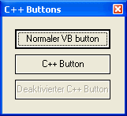



## C\+\+ Buttons \[Deutsch\]

### Description

Dieser code ändert einfache VB Buttons in hübsche C++ Buttons um.
 
### More Info
 

             |
---                |---
**Submitted On**   |2003-10-04 10:05:04
**By**             |[zpage](https://github.com/Planet-Source-Code/PSCIndex/blob/master/ByAuthor/zpage.md)
**Level**          |Beginner
**User Rating**    |5.0 (10 globes from 2 users)
**Compatibility**  |VB 5\.0, VB 6\.0
**Category**       |[Custom Controls/ Forms/  Menus](https://github.com/Planet-Source-Code/PSCIndex/blob/master/ByCategory/custom-controls-forms-menus__1-4.md)
**World**          |[Visual Basic](https://github.com/Planet-Source-Code/PSCIndex/blob/master/ByWorld/visual-basic.md)
**Archive File**   |[C\+\+\_Button1653771042003\.zip](https://github.com/Planet-Source-Code/zpage-c-buttons-deutsch__1-48998/archive/master.zip)

